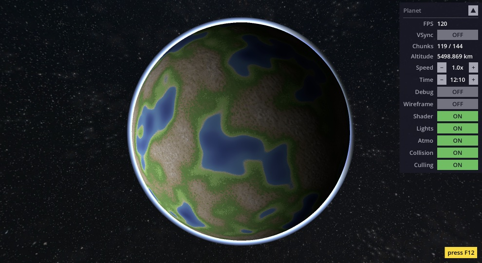
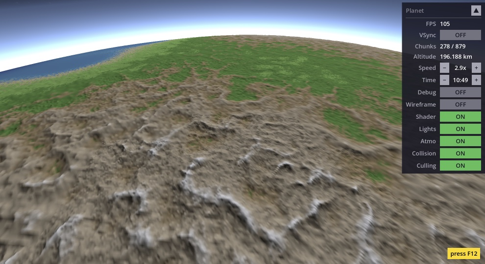
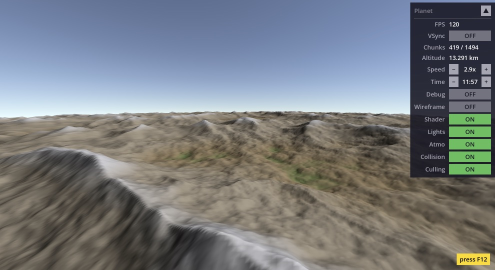
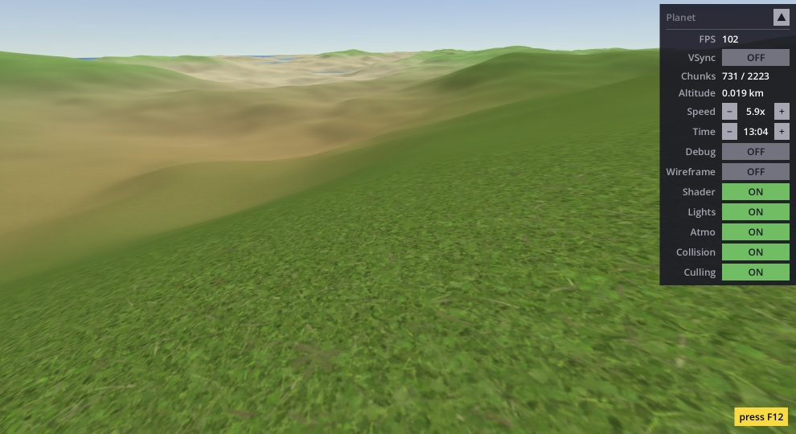
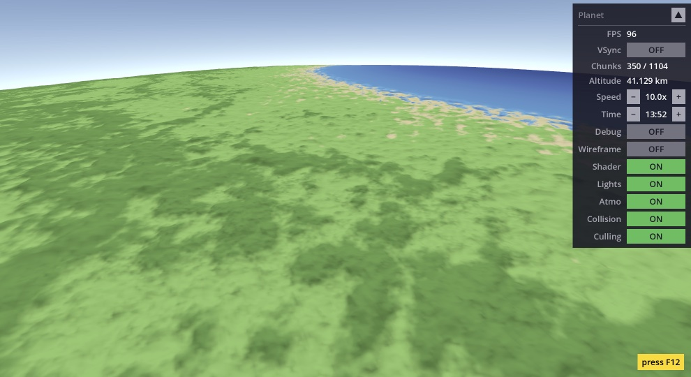
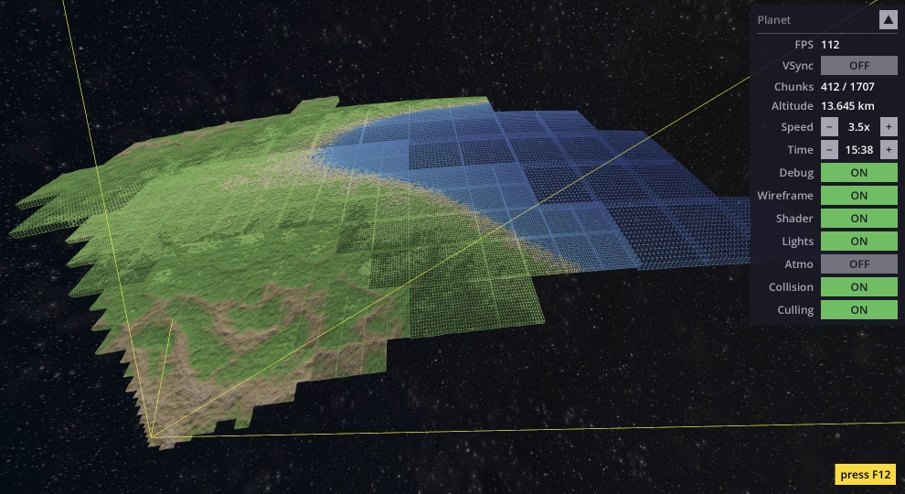
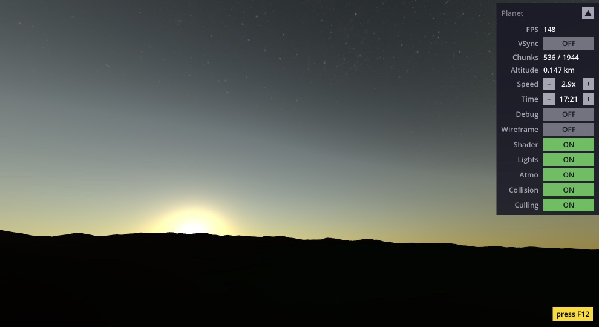
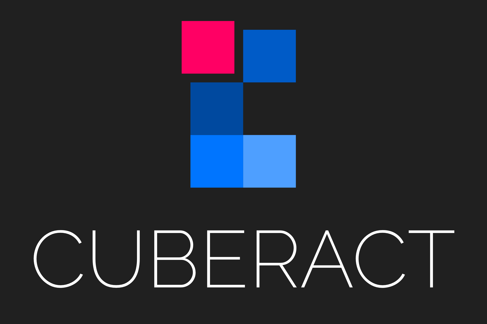

# Chunked LOD Planet

A procedurally generated planet with dynamic level-of-detail, written entirely in GDScript for Godot 4.6. Designed as a **learning resource** — read this document first, then explore the code.

  



## What is this?

This project renders a full-size planet (Earth radius, ~6 378 km) with terrain that dynamically increases in detail as the camera approaches and simplifies as it moves away. You can fly from orbit all the way down to the surface and see individual hills — the mesh adapts continuously.

The technique is called **chunked LOD** (Level of Detail). The planet surface is divided into a tree of rectangular patches (chunks). Near the camera, chunks split into 4 smaller children. Far away, children merge back into one parent. The result is high detail where you need it and low detail where you don't.

**Origin story:** I originally built this as a Java project about 15 years ago using the Ardor3D engine. That engine no longer exists and the project couldn't even run anymore. So I rewrote it from scratch in pure GDScript for Godot — intentionally keeping it simple and readable.

Everything is in GDScript + two GLSL shaders (terrain + atmosphere). No C++, no GDExtensions, no external plugins. Just open the project in Godot and hit Play.

## Screenshots

| | |
|:---:|:---:|
|  |  |
|  |  |
|  |  |

## Getting started

1. Clone the repository
2. Open in Godot 4.6+
3. Press F5 (or click Play)

No build steps, no dependencies, no setup.

## Controls

| Key | Action                                                  |
|-----|---------------------------------------------------------|
| **W / A / S / D** | Move forward / left / backward / right                  |
| **R / F** | Rise / fall                                             |
| **Q / E** | Roll left / right                                       |
| **Mouse** | Look around (click to capture, ESC to release)          |
| **Scroll wheel** | Adjust speed multiplier                                 |
| **H** | Reset camera to starting position                       |
| **X** | Free unused chunks (release GPU memory)                 |
| **Tab** | Debug observer mode (freeze LOD, free-fly debug camera) |
| **V** | Toggle VSync                                            |
| **F1** | Toggle wireframe                                        |
| **F2** | Toggle shader (ON = terrain, OFF = simple colors)       |
| **F3** | Toggle lighting                                         |
| **F4** | Toggle atmosphere                                       |
| **F5** | Toggle terrain collision                                |
| **F6** | Toggle frustum & horizon culling                        |
| **O / P** | Time of day − / + (hold for continuous rotation)        |
| **Space** | Collapse / expand HUD panel                             |
| **F12** | Show/hide controls overlay                              |

## Tweaking at runtime

The planet is fully configurable while the game is running. Hit Play, then use Godot's Remote inspector to experiment.

### Planet properties

Select the **Planet** node in the Remote scene tree. The inspector shows exported properties you can change on the fly:

- **radius** — planet size (100–10 000 km)
- **terrain_height** — mountain amplitude (1–100 km)
- **atmosphere_height** — thickness of the atmosphere shell (110–500 km)
- **grid_size** — vertices per chunk edge (must be power of 2: 4, 8, 16, 32, 64)
- **lod_threshold_deg** — how aggressively chunks split (5–45°, lower = more detail)
- **max_lod_level** — deepest quadtree depth (2–20)
- **split_budget** — max splits per frame

After changing any of these, check the **Rebuild** checkbox to apply. The planet destroys all chunks and rebuilds from scratch with the new settings.

### Shader materials

Open `materials/terrain.tres` or `materials/atmosphere.tres` in the inspector (double-click the file in the FileSystem dock). Changes apply instantly — no rebuild needed.

**Terrain material** — organized into inspector groups:
- **lighting** — ambient light, shadow strength, normal computation toggle
- **continental / mountains / detail / micro** — noise layer parameters (scale, octaves, strength)
- **colors** — 10 color pickers for the elevation palette (deep ocean through snow peak)
- **textures** — triplanar texture settings (scale, slope blending, distance fade)

**Atmosphere material** — under the **scattering** group:
- **kr / km** — Rayleigh and Mie scattering coefficients
- **sun_intensity** — brightness of the sun
- **g** — Mie phase asymmetry (controls sun halo size)
- **wavelength_r / g / b** — light wavelengths in micrometers (change these to get an alien sky)

> **Tip:** Drag the sliders slowly and watch the planet update in real time. Try setting `wavelength_r` and `wavelength_g` to similar values for a purple atmosphere, or crank up `mountain_sharpness` for jagged alien peaks.

---

# Implementation deep dive

This section walks through every technique used in the project. After reading it, you should understand the complete rendering pipeline — from a cube to a textured, lit planet with dynamic detail.

## The big picture

The rendering pipeline has five stages:

1. **Cube → Sphere** — Start with a cube. Project each face onto a sphere.
2. **Quadtree LOD** — Subdivide each face into a recursive tree of chunks. Split chunks near the camera, merge chunks far away.
3. **Mesh building** — Each chunk is a flat grid on the ideal sphere (no terrain yet). Chunks are recycled from a pool.
4. **Shader terrain** — A GPU shader displaces the flat mesh vertices using procedural noise (mountains, valleys) and colors everything per-pixel (ocean, grass, rock, snow, textures, lighting).
5. **Atmosphere** — A second shader renders atmospheric scattering on a transparent sphere around the planet — blue sky from the surface, a thin glow from orbit.

GDScript handles stages 1–3 (geometry and LOD decisions). The shaders handle stages 4–5 (terrain appearance and atmosphere). This separation keeps the GDScript simple — it only deals with flat sphere patches — while the shaders make them look like a real planet.

## Cube-to-sphere projection

The planet starts as a unit cube with 6 faces. Each face is projected onto a sphere.

The naive approach — just normalizing each vertex position — creates a sphere, but the vertices bunch up near the cube corners and spread thin near the face centers. This uneven distribution means some chunks get stretched and others get squished.

This project uses the **spherified cube** mapping instead. The formula warps each axis independently:

```
nx = x * sqrt(1 - y²/2 - z²/2 + y²z²/3)
ny = y * sqrt(1 - z²/2 - x²/2 + z²x²/3)
nz = z * sqrt(1 - x²/2 - y²/2 + x²y²/3)
```

The result is a much more uniform vertex distribution across the sphere. Chunks are similar in size regardless of where they sit on the surface, which means the LOD system works evenly everywhere.

> **Alternatives:** Google's S2 geometry library uses a different cube-to-sphere mapping optimized for spatial indexing. Catmull-Clark subdivision could also produce a sphere. The spherified cube was chosen here for simplicity — it's a single formula with no iterative steps.

## Quadtree LOD

Each of the 6 cube faces is the root of a **quadtree**. A quadtree is a tree where every node has either 0 children (leaf) or exactly 4 children. Leaf nodes hold a visible mesh chunk. Interior nodes are invisible — they exist only to organize the tree.

### Split and merge

Every frame, the quadtree walks itself recursively. For each node:

1. **Visibility test** — Is this chunk visible? (More on culling below.)
2. **LOD decision** — If the chunk appears "too large" on screen, split it. If all 4 children appear small enough, merge them back.

"Too large on screen" is measured by **angular size**: the chunk's real-world size divided by the distance to the camera. If that angle exceeds a threshold (configurable, default 10°), the chunk needs more detail.

The distance thresholds are **precomputed** at startup for every possible tree level. At level 0 (a whole cube face), the threshold distance is huge. At level 15 (a tiny patch), it's small. This avoids doing trigonometry every frame.

### Hysteresis

A naive system that splits at distance X and merges at distance X would flicker: the camera sits right at the boundary, chunks split, the camera is now fractionally farther (because chunk centers moved), chunks merge, repeat forever.

The fix is **hysteresis**: merge uses a slightly larger distance threshold than split (0.1° difference). This creates a dead zone where neither split nor merge happens, eliminating flickering.

### Frame budget

Splitting a chunk requires building a new mesh — that's not free. To prevent frame rate drops when lots of chunks need splitting at once (e.g. flying quickly toward the surface), the system limits splits to a **budget** per frame (default: 8). Merges are cheap (they reuse existing vertex data) so they have no limit.

The budget is shared across the entire quadtree as a single counter passed by reference through the recursive walk.

> **Alternatives:** GPU tessellation (hardware subdivision) can achieve similar results with less CPU code, but offers less control over the LOD transitions and isn't available on all platforms Godot targets (e.g. WebGL). The explicit quadtree approach used here is more portable and easier to understand.

## Mesh building

Each chunk is a **17×17 vertex grid** (16 segments per edge). The vertices lie on the ideal sphere surface — no terrain displacement. The mesh is flat and smooth; the shader adds all the bumps.

Why 17×17? It's a power-of-two grid (16) plus 1 for the edge vertices. This specific size allows the split optimization described below.

### Three build paths

Building a chunk can happen in three ways:

**1. Fresh build** — Compute all 289 vertices from scratch using bilinear interpolation of the 4 corner positions, then project each onto the sphere. Used for root-level chunks at startup.

**2. Split (from parent)** — When a parent splits into 4 children, each child covers one quarter of the parent's grid. Vertices at even grid positions (every other row and column) already exist in the parent's data — they can be copied directly. Only the odd-position vertices need new sphere projection. In a 17×17 grid, 81 out of 289 vertices are reused (~28% saved). The saving is modest per split, but splits happen frequently during camera movement, so it adds up.

**3. Merge (from children)** — When 4 children merge back into one parent, the parent reconstructs its grid by sampling every other vertex from each child. No sphere projection at all — 100% reuse.

The split/merge optimizations are important because sphere projection (the `_spherify` formula) is relatively expensive, and chunks are built every time the LOD changes.

> **Alternatives:** Compute shaders could generate mesh data on the GPU, which would be much faster. But they require a very different architecture, are harder to debug, and aren't supported on all Godot platforms. The CPU approach here is fast enough and much simpler to follow.

## Terrain generation

This is where the planet gets its mountains, valleys, and oceans. The entire terrain — geometry, color, textures, and lighting — is computed by a single GLSL shader (`terrain.gdshader`). The GDScript side knows nothing about terrain shape.

### Why shader-only?

The traditional approach is to displace vertices on the CPU and send the final mesh to the GPU. That works, but it means terrain detail is limited by mesh resolution — a 17×17 grid can only show 17×17 height samples.

The shader approach displaces vertices in the **vertex shader** (per-vertex terrain height) and then computes color and lighting in the **fragment shader** (per-pixel). The fragment shader samples the same noise function but at screen resolution, giving sharp biome boundaries and detailed coloring even on coarse LOD meshes. One noise function serves both geometry and appearance.

### Noise function

The shader uses a custom **3D gradient noise** (Perlin-like) built from an integer hash function:

```glsl
uint ihash(uint n) {
	n = (n << 13u) ^ n;
	n = n * (n * n * 15731u + 789221u) + 1376312589u;
	return n;
}
```

This hash is **deterministic across GPU and CPU** — it uses only integer arithmetic, no `sin()`. Many shader noise implementations use `sin(dot(p, magic_numbers))` which produces slightly different results on different GPUs. The integer approach avoids that problem.

A CPU-side replica of the same noise exists in `terrain_noise.gd` for camera-terrain collision detection. Both implementations must produce identical results, which is why the integer hash matters.

> **Alternatives:** Godot's built-in `FastNoiseLite` is easier to set up but only runs on the CPU — it can't be used inside a shader. Some projects compute terrain on the CPU and upload height maps as textures for the shader to read, but that adds complexity and bandwidth. The all-in-shader approach keeps terrain as a single source of truth.

### Noise layers

The terrain is built from 4 noise layers, each adding a different scale of detail:

| Layer | Type | What it creates |
|-------|------|-----------------|
| **Continental** | Gradient noise (2 scales blended) | Large-scale land/ocean shapes |
| **Mountains** | Ridged noise (absolute value folding) | Sharp mountain ridges, only on land |
| **Detail** | FBM (Fractal Brownian Motion) | Rolling hills and small bumps |
| **Micro** | Single noise call | Tiny surface roughness |

Each layer is scaled and weighted independently via shader uniforms (editable in the inspector at runtime). The continental layer also drives a **land mask** — ocean areas suppress mountains and detail, so you don't get mountain ridges underwater.

> **A note on terrain quality:** The noise setup here is intentionally basic — just enough to demonstrate the technique. Creating visually convincing procedural terrain at planetary scale is an art form in its own right — like sculpting with mathematics. You can spend hundreds of hours fine-tuning layer interactions, erosion simulation, biome transitions, and continent shapes before the result starts looking production-ready. This project focuses on the LOD system, not on winning awards for terrain aesthetics.

### Elevation coloring

The shader maps terrain elevation (0.0 = ocean floor, 1.0 = highest peak) to a 14-band color palette with 10 unique colors:

- Deep ocean → ocean → shallow water → beach → lowland → highland → rock → high rock → snow line → snow peak

Colors are linearly interpolated between adjacent bands for smooth transitions. All 10 colors are exposed as `source_color` uniforms in the shader's `colors` group — editable in the inspector at runtime via color pickers.

### Triplanar texturing

Close to the surface, the flat elevation colors would look bland. The shader blends in photo textures (sand, grass, ground, gravel, snow) using **triplanar mapping** — the texture is projected from all 3 axes and blended based on the surface normal. This avoids UV stretching that would occur with a single projection direction on a sphere.

Textures fade out with distance (configurable near/far range) so they don't cause aliasing artifacts from orbit. On steep slopes, a gravel texture overrides the elevation-based texture to simulate exposed rock faces.

### Lighting

The shader uses `render_mode unshaded` — Godot's built-in PBR lighting is completely bypassed. Instead, the shader computes its own **Lambert diffuse** lighting from a directional light source (the sun):

```glsl
float diffuse = max(dot(normal, light_dir), 0.0) * hemisphere;
color *= ambient + (1.0 - ambient) * diffuse;
```

The sun direction is set via `Planet.sun_direction` — a `Vector3` that is passed to the shader as a uniform. Planet itself has no concept of a sun object or orbit. In the demo, `Example` creates a visual sun mesh, orbits it around the planet, and updates `planet.sun_direction` each frame. If you use Planet in your own project, just set `sun_direction` however you like — from your own light source or from a script.

The `hemisphere` term handles **planet self-shadowing**: if a point on the surface faces away from the sun (based on the planet's radial direction, not the terrain normal), it gets no direct light regardless of its local surface orientation. This prevents impossible lighting on the dark side.

Surface normals are computed per-vertex by sampling noise at two offset points and computing the gradient. The offset distance (vertex spacing in noise coordinates) is passed per-vertex via `UV2.x`, keeping normal detail proportional to mesh resolution across all LOD levels.

> **Alternative:** Godot supports per-instance shader parameters (`set_instance_shader_parameter()`), which would be a cleaner way to pass a single per-chunk value. However, instance uniforms don't work reliably on WebGL, so embedding the value in vertex data is the safer choice.

## Culling

Not all chunks need to be rendered every frame. Two culling techniques skip invisible chunks early.

### Frustum culling

The camera sees a pyramid-shaped volume (the **frustum**). Chunks outside this volume are invisible. The test checks each chunk's **axis-aligned bounding box (AABB)** against the 6 frustum planes.

For each plane, the test finds the AABB corner closest to the plane's inside (the **n-vertex**). If even that corner is outside, the entire chunk is outside — early rejection. If the opposite corner (the **p-vertex**) is inside all 6 planes, the chunk is fully inside and its children can skip the frustum test entirely.

This hierarchical optimization is significant: once a parent is confirmed fully inside the frustum, none of its descendants need frustum testing.

The AABB is computed from 5 points on the ideal sphere (4 corners + center for curvature), each expanded radially by `terrain_height` to account for the maximum possible shader displacement.

**Important detail:** Godot has its own built-in frustum culling for MeshInstance3D nodes. But it doesn't know about our shader displacement — it would cull chunks that have visible mountains poking into view. To prevent this, every chunk's `custom_aabb` is set to a planet-wide bounding box, effectively telling Godot "never cull this mesh yourself." Our manual culling via `chunk.visible` takes over instead.

> **Alternatives:** Bounding sphere tests are simpler but less tight than AABB tests, leading to more false positives (chunks that pass the test but aren't really visible). Oriented bounding boxes (OBB) would be tighter but more expensive to test. AABB is a good middle ground.

### Horizon culling

Even chunks that pass the frustum test might be hidden by the planet itself. If you're standing on the surface and looking at the horizon, everything beyond that circle is blocked by the planet's curvature.

The test uses **angular geometry**: it computes the angle from the camera to the planet's geometric horizon (based on camera altitude), adds an extension for terrain height (mountains can peek above the geometric horizon), and compares this to the angle between the camera and the chunk. If the chunk's nearest edge is beyond the combined horizon angle, it's culled.

This is especially effective from low altitudes where the planet blocks over half of all chunks. From orbit, horizon culling barely helps (most chunks are above the horizon anyway), but frustum culling takes over there.

## Skirt geometry

When two adjacent chunks are at different LOD levels (one is more detailed than the other), their edges don't match up perfectly. The fine chunk has more vertices along the shared edge than the coarse chunk. This mismatch creates visible **cracks** (T-junction artifacts) where you can see through the mesh to the sky behind it.

The fix is a **skirt**: an extra ring of triangles hanging below each chunk edge, pushed toward the planet center. The skirt fills in any cracks by extending below the neighboring chunk's surface. It's invisible from above (the actual mesh covers it) but plugs the gaps when viewed from the side.

Skirt vertices are flagged with vertex color alpha = 0.0. The shader checks this flag and skips terrain displacement for skirt vertices — they stay at their lowered position instead of being pushed back up by noise.

> **Alternatives:** Geomorphing smoothly blends vertices between LOD levels, eliminating cracks without extra geometry. It produces cleaner transitions but is significantly more complex to implement — each vertex needs to know its "target" position in the parent LOD. The skirt approach solves the same visual problem with much simpler code.

## Origin shifting

Godot uses 32-bit floating-point numbers for positions. At distances beyond ~10 000 units from the world origin, float precision starts to degrade — vertices jitter visibly because the gaps between representable numbers grow larger.

A planet with radius 6 378 km means the camera routinely operates at distances of thousands of units from wherever the planet sits. Without mitigation, this would cause obvious jittering, especially on mesh edges near the camera.

The solution is **origin shifting**: every frame, the planet's position is adjusted so the active camera stays at (or very near) the world origin. Instead of the camera moving through the world, the world moves around the camera. Visually, the result is identical, but all vertex calculations happen near (0, 0, 0) where float precision is highest.

The shift is handled by `PlanetCamera` — a Camera3D subclass that every frame checks the active camera's position. If it has drifted away from the origin, PlanetCamera shifts both itself and the Planet node so the active camera ends up back at `(0, 0, 0)`. Since Planet is a sibling node (not a child of the camera), it doesn't inherit camera rotation — only position shifts affect it.

Any 3D objects you add as **children of Planet** will shift correctly — they inherit Planet's transform automatically. This is the intended way to place objects on or near the planet surface (buildings, trees, vehicles). Don't place world objects as siblings of Planet — they won't participate in origin shifting and will jitter at large distances.

The shader receives the updated planet origin as a uniform so it can compute correct noise coordinates.

> **Gotcha:** If you store a world-space position (e.g. a waypoint) and use it later, it will be wrong — origin shifting moved everything since you stored it. Always store positions **relative to Planet** (`planet.to_local(world_pos)`) and convert back when needed (`planet.to_global(local_pos)`).

> **Alternatives:** Double-precision (64-bit) floats would solve the precision problem outright. Godot supports building the engine with double precision enabled, but that requires compiling the engine from source — not something a beginner would do casually. Origin shifting achieves a similar result with zero engine modifications. Some engines (like Outerra or Space Engine) use double precision on the CPU and convert to camera-relative single precision for the GPU, which is conceptually similar to what origin shifting does here.

## Chunk pooling

Chunks (MeshInstance3D nodes) are expensive to create — each one requires allocating GPU buffers, adding a node to the scene tree, and setting up materials. During LOD changes, chunks are constantly being created and destroyed as the quadtree splits and merges.

Instead of creating and destroying nodes, the system maintains a **pool**: a LIFO stack of pre-created Chunk instances stored under a dedicated `ChunkPool` child node. When a quad needs a chunk, it **acquires** one from the pool. When a quad no longer needs its chunk (because it split into children), it **releases** the chunk back to the pool.

Released chunks are hidden (`visible = false`) but stay in the scene tree under ChunkPool. When acquired again, they just need new mesh data and to be made visible. This eliminates allocation overhead during gameplay. The ChunkPool container keeps the scene tree clean — all chunks are grouped together, so any objects you add as children of Planet (buildings, trees) won't be buried among hundreds of chunk nodes.

The pool grows on demand — if a chunk is requested and the pool is empty, a new one is created. Over time, the pool reaches a stable size that covers the worst-case LOD state. Calling `planet.free_unused_chunks()` destroys all pooled (inactive) chunks and frees their GPU memory — active chunks are not affected and the pool will grow again as needed. `rebuild_planet()` also clears the entire pool since chunks may need different buffer sizes after configuration changes.

## Atmosphere

The planet is surrounded by an atmosphere rendered as a transparent sphere slightly larger than the planet surface (`radius + atmosphere_height`). A second shader (`atmosphere.gdshader`) computes **Rayleigh scattering** — the same physical effect that makes Earth's sky blue and sunsets orange.

### How it works

Light traveling through the atmosphere scatters more at shorter wavelengths (blue) than longer ones (red). The shader **ray-marches** from the camera through the atmosphere sphere, sampling scattering at several points along the path. Each sample considers:

- **Optical depth** — how much atmosphere the light has passed through (more atmosphere = more scattering)
- **Phase function** — scattering is strongest when looking toward or away from the sun, weakest at 90°
- **Wavelength dependence** — blue light scatters ~5.5× more than red (inverse fourth power of wavelength)

The result: from orbit, you see a thin blue-white glow around the planet's limb. From the surface, the sky overhead is deep blue, fading to a brighter horizon where the atmospheric path is longest. Near the terminator (day/night boundary), the atmosphere takes on warm sunset tones.

### Inside vs outside

The shader uses `cull_front` — only back faces are rendered. When the camera is outside the atmosphere sphere, these back faces form the glow around the planet's edge. When inside, the back faces become the sky dome above you. This works because the sphere surrounds the camera in both cases — no material swapping or face-direction logic needed.

### Blending with the skybox

The atmosphere uses `blend_mix` with computed alpha. Strong scattering (daytime sky) produces high alpha that covers the star background. Weak scattering (edge of atmosphere, dark side) produces low alpha that lets stars shine through. This creates a natural transition where stars fade out as you enter the atmosphere.

> **Alternatives:** Screen-space post-processing atmosphere (applied as a full-screen quad reading the depth buffer) would avoid the sphere mesh entirely and work at any scale. But it requires understanding Godot's rendering pipeline at a deeper level. The sphere approach is geometrically intuitive — the atmosphere is literally a ball of air around the planet.

## Camera

The camera system is split into two parts:

**`PlanetCamera`** (`planet_camera.gd`) — A reusable Camera3D subclass with planet-aware features. Place it as a **sibling** of Planet in the scene tree and set the `planet` export in the inspector:

- **Origin shifting** — Keeps the active camera near world origin (described above).
- **Auto-leveling** — After rotating the camera, its "up" direction may no longer point away from the planet center. Without correction, the horizon would appear tilted. The camera gradually lerps its up vector toward the planet's radial direction each frame, keeping the horizon level. The effect **fades out with altitude** — in orbit, auto-leveling is disabled so the camera flies freely like in zero gravity.
- **Dynamic near/far** — The near and far clip planes adjust based on altitude. Close to the surface, the near plane is small (0.001) to avoid clipping nearby terrain, and the far plane is modest. In orbit, both expand. The far plane always includes at least the distance to the planet center, so the planet never disappears when flying away from it. The ratio is kept reasonable to prevent z-fighting (depth buffer precision issues).
- **Terrain collision via `move()`** — PlanetCamera doesn't check collision in `_process()`. Instead, it provides a `move(offset, clamp_to_terrain)` method. The caller decides whether collision is active. This avoids frame-ordering issues — the collision check happens in the same call as the movement, not a frame later. The terrain height is computed using a **CPU-side replica** of the shader's noise function (`terrain_noise.gd`). This replica reads its parameters from the shader material each frame, so any changes to terrain shape in the inspector are automatically reflected in the collision.

PlanetCamera contains **no input handling** — it doesn't know how to move. You move it from an external script however you like (keyboard, gamepad, scripted animation). Call `planet_camera.move(offset, true)` for movement with terrain collision, or `planet_camera.move(offset, false)` for free flight.

**`Example`** (`example.gd`) — A demo-only controller that moves PlanetCamera (WASD + mouse), creates the HUD, manages a visual sun with orbit, and implements a debug observer mode. This script is **not needed** for the planet to work. Delete it and write your own controls — just move PlanetCamera from your script and it handles origin shifting, terrain collision, auto-leveling, and clip planes on its own.

## Scene hierarchy

```
Main (Node3D)
├── PlanetCamera (Camera3D)         Sibling of Planet — origin shifting, auto-leveling,
│                                   dynamic clip planes, terrain collision
├── Planet (Node3D)                 Quadtree LOD, chunk pool, atmosphere, shader material
│   ├── ChunkPool (Node3D)          Container for all chunk meshes (runtime)
│   └── Atmosphere (MeshInstance3D) Scattering sphere (runtime)
├── Example (Node)                  Demo controller: flight controls, HUD, visual sun,
│                                   debug mode (not needed for reuse)
└── WorldEnvironment                Star panorama skybox
```

To use PlanetCamera + Planet in your own project, copy `PlanetCamera`, `Planet`, and the `scripts/`, `shaders/`, `materials/`, and `textures/` folders. Set `PlanetCamera.planet` to your Planet node in the inspector. Add your own camera controller and you're done — `Example` and `WorldEnvironment` are optional.

## File structure

```
├── main.tscn                       Main scene (see hierarchy above)
├── scripts/
│   ├── planet_camera.gd            PlanetCamera: origin shifting, auto-leveling,
│   │                               dynamic clip planes, move() with collision
│   ├── planet.gd                   Planet: quadtree roots, LOD thresholds, chunk pool,
│   │                               atmosphere, sun_direction, get_terrain_height(),
│   │                               get_distance_to_terrain()
│   ├── quad.gd                     Quadtree node: split/merge logic, frustum culling,
│   │                               horizon culling, visibility decisions
│   ├── chunk.gd                    Mesh builder: grid generation, sphere projection,
│   │                               skirt geometry, bounding volumes
│   ├── terrain_noise.gd            CPU-side noise replica (for terrain collision)
│   └── example.gd                  Demo controller: flight controls, HUD, visual sun,
│                                   debug observer mode (not needed for reuse)
├── shaders/
│   ├── terrain.gdshader            Terrain: vertex displacement, elevation coloring,
│   │                               triplanar textures, Lambert lighting
│   └── atmosphere.gdshader         Atmosphere: Rayleigh scattering, per-pixel ray march
├── materials/
│   ├── terrain.tres                Terrain ShaderMaterial (colors, noise, textures, lighting)
│   └── atmosphere.tres             Atmosphere ShaderMaterial (scattering, wavelengths)
├── textures/                       Terrain textures (sand, grass, ground, gravel, snow)
│                                   + star panorama for skybox
└── media/                          Screenshots for this README
```

## Support

If you find this project useful, consider supporting my work:

[](https://ko-fi.com/cuberact)

- **News and updates:** [X / Twitter](https://x.com/cuberact)
- **Devlogs and demos:** [YouTube](https://www.youtube.com/@Cuberact)

## License

MIT — use it however you like. If you build something cool with it, I'd love to hear about it.

## Author



I'm a solo indie developer building tools and games with Godot Engine under the **Cuberact** label. This planet project started as a Java/Ardor3D experiment about 15 years ago — now rewritten for Godot as a learning resource for the community.

More projects at [cuberact.org](https://www.cuberact.org).
